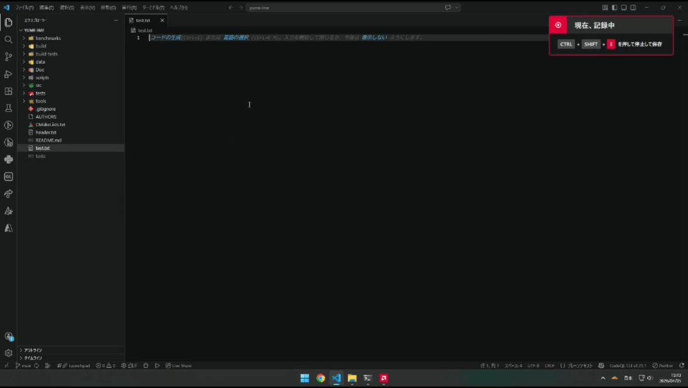

# Yume - Japanese Input IME

### [日本語はこちら](./README_ja.md)
A fully open-source IME released under the MIT License. It automatically generates Katakana and Romaji candidates from Hiragana input, providing an efficient typing experience.  
Copyright (c) 2026-present cyan-cs



## 1. Features
- All code for this IME is published under the MIT License.
- Half-width Katakana and full-width English characters, which are rarely used today, have been removed.
- Uses a relatively modern UI design.

## 2. Installation

**Quick Install (Recommended):**
```powershell
# Run as Administrator
.\scripts\Register-YumeIME.ps1
````

For details, see the [Installation Guide](./Doc/ja/user_doc/install_ja.md).

## 3. Build

### Build Only

```powershell
.\scripts\build.ps1
```

### Build & Register

```powershell
# Run as Administrator
.\scripts\Register-YumeIME.ps1
```

### Uninstall

```powershell
# Run as Administrator
.\scripts\unregister-YumeIME.ps1
```

For details, see the [Build Guide](./Doc/ja/user_doc/build_ja.md).

## 4. Documentation

* **For Users**

  * [Installation](./Doc/ja/user_doc/install_ja.md)
  * [Troubleshooting](./Doc/ja/user_doc/troubleshooting_ja.md)

* **For Developers**

  * [Architecture](./Doc/ja/dev_doc/architecture_ja.md)
  * [Coding Style](./Doc/ja/dev_doc/coding_style_ja.md)
  * [Contributing Guide](./Doc/ja/dev_doc/contributing_ja.md)
  * [Environment Setup](./Doc/ja/dev_doc/environment_ja.md)

* **English Documentation**

  * [Installation Guide](./Doc/en/user_doc/install_en.md)
  * [Troubleshooting](./Doc/en/user_doc/troubleshooting_en.md)
  * [Architecture](./Doc/en/dev_doc/architecture_en.md)
  * [Contributing Guide](./Doc/en/dev_doc/contributing_en.md)

## 5. Known Issues (Todo)

Planned to be fixed in v0.2:

* Priority dictionary merging after numeric input
* Prediction confirmation bug when entering hyphens
* Prediction confirmation bug when pressing space

For details, see [Troubleshooting](./Doc/ja/user_doc/troubleshooting_ja.md#known-issues).

## 6. License

All Yume-IME code is released under the [MIT License](https://opensource.org/license/mit).

## 7. Support
If you like it, I'd appreciate it if you could give it a star.<br /><br />
[](https://ko-fi.com/0cyan)
